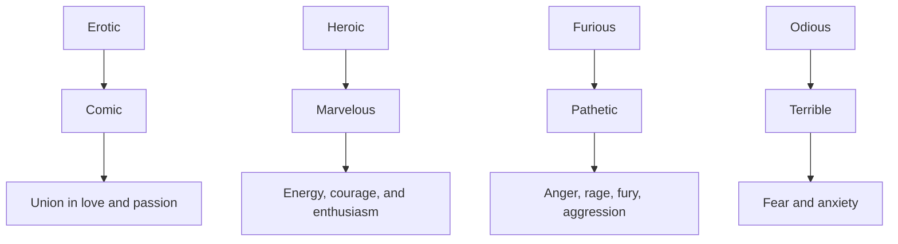

The Natyashastra, attributed to Bharata Muni, is a foundational text on performing arts in ancient India. It covers drama, dance, and music in a highly systematic way. The work is presented as a dialogue and aims to guide artists in creating meaningful and emotionally engaging performances.

One of its central ideas is the concept of _Rasa_, or aesthetic emotion. According to Bharata Muni, a successful performance evokes specific emotional responses—like love, anger, or wonder—in the audience. These emotions are produced through a combination of expressions, gestures, music, and storytelling, allowing viewers to experience a deeper artistic and emotional connection. This is what is referred to as Rasa.

Here are traditionally 8 ***Rasas*** such as:

- Love (*Śṛṅgāra*)
- Heroism (*Vīra*)
- Anger (*Raudra*)
- Fear (*Bhayānaka*)
- Disgust (*Bībhatsa*)
- Wonder (*Adbhuta*)
- Laughter (*Hāsya*)
- Sadness (*Karuṇa*)

In it, detailed aspects of of the theatrical science(*Natyaveda*), Sutras and their commentaries(*Bhashyas*) are compressed to make Digest(*Samgraha* or 'collection' in easy words). The Digest/collection includes the States(*Bhavas)* and the Sentiments(*Rasa*). 

Sentiments are produced from a combination of Determinants, Consequents and Transitory States(Bhavas).

There are 4 Original Sentiments from which all other Sentiments arise:

### Categories and Dominant Emotions

#### 1. Erotic → Comic

**Dominant Emotion:**  
Union in love and passion

---
#### 2. Heroic → Marvelous

**Dominant Emotion:**  
Energy, courage, and enthusiasm

---
#### 3. Furious → Pathetic

**Dominant Emotion:**  
Anger, rage, fury, wrath, aggression, etc.

---
#### 4. Odious → Terrible

**Dominant Emotion:**  
Fear and anxiety

---

Overall, the _Natyashastra_ serves as a comprehensive guidebook for the performing arts, blending theory with practice. Its influence continues to shape classical Indian dance and theatre traditions today, making it one of the most important works in the history of aesthetics and performance.

**NOTE:** Additionally, Digest also includes aspects like Histrionic representation(Gestures, Words, Dresses and Make-up), Practices(*Dharmas*), Styles of theatricality, Successes, Musical Notes and Instruments, etc.